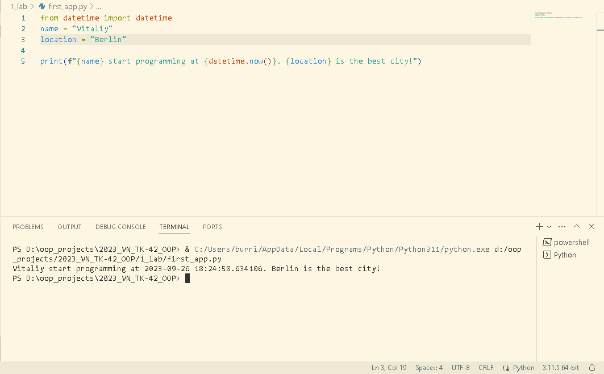

# Звіт до роботи №1
## Тема: _Оформлення робіт та перша програма_
### Мета роботи: _Навчитись оформляти роботи з використання форматування Markdown та створити першу програму на Python;_
---
### Виконання роботи
- Результати виконання завдання:
    1. Розробили [першу програму у файлі `first_app.py`](first_app.py);
    1. Програма вивела результат:  :star2:;
    1. Створили [Python Notebook `first_app.ipynb`](first_app.ipynb) та попрактикувались у роботі з комірками :star2:;
    1. Отримані результати та робота AI ChatGPT представлена у [Python Notebook `first_app.ipynb`](first_app.ipynb) :star2:;
    1. Навчились створювати файли для програм Python та працювати у Python Notebook, ;

- основний код з яким працювали у завданні :
```python
from datetime import datetime
name = "Vitaliy"
location = "Berlin"

print(f"{name} start programming at {datetime.now()}. {location} is the best city!")
```

- результати виконання індивідуального завдання - робота з ChatGPT представлена у [Python Notebook `first_app.ipynb`](first_app.ipynb);

### Висновок: 
- :question: Що зроблено в роботі: створено першу програму у Python, навчились працювати з форматуванням Markdown, навчились працювати з Python Notebooks
- :question: Чи досягнуто мети роботи: так :white_check_mark:
- :question: Які нові знання отримано: навчивлись працювати з Python Notebook
- :question: Чи вдалось відповісти на всі питання задані в ході роботи: так :white_check_mark:
- :question: Чи вдалося виконати всі завдання: так :white_check_mark:
- :question: Чи виникли складності у виконанні завдання: ні :x:
- :question: Чи подобається такий формат здачі роботи (Feedback): так :+1:
- :question: Побажання для покращення (Suggestions): немає, все чудово :clap:
---
