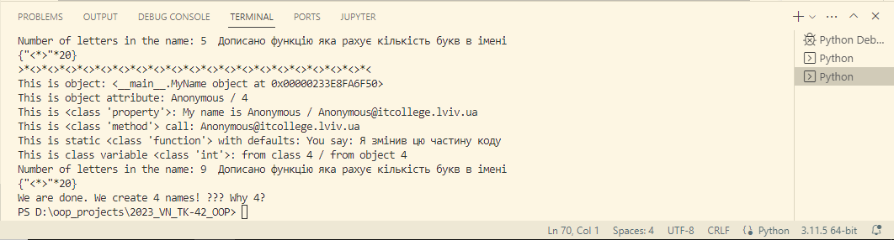

# Звіт до роботи №3
## Тема: _Знайомство з ООП_
### Мета роботи: _навчитись працювати та створювати власні класи в Python_
---
### Виконання роботи
- Результати виконання завдання:
    1. Створив [Python Notebook](.ipynb) та почав виконувати завдання;
    1. Скопіював клас з лабораторної роботи та модифікував його згідно поданого завдання; 
    1. Програма вивела значення у скріншоті який представлений нижче;
    1. Отримані результати представлені у [MyFirstClass](MyFirstClass.py) та [Python Notebook](MyFirstClass.ipynb);
    1. Навчився створювати власні класи та працювати з ними в Python, ознайомився з ООП.

- Скріншнот виконання програми: :star2:

 

- Відповідь на запитання: :star2:
   1. Чому коли передаємо значення None створюється обєкт з іменем Anonymous?
   `Відповідь:` якщо name дорівнює None, викликається метод anonymous_user() для створення об'єкта з ім'ям "Anonymous", і це ім'я потім використовується для встановлення self.name.

   1. Як змінити текст привітання при виклику методу say_hello()? Допишіть цю частину коду.
   `Відповідь:` щоб змінити текст привітання достатньо змінити текст змінної message у функції say_hello().

   1. Допишіть функцію в класі яка порахує кількість букв і імені (підказка: використайте функцію len());
   `Відповідь:` дописав функцію, вона написана у [MyFirstClass](MyFirstClass.py) та [Python Notebook](MyFirstClass.ipynb)

   1. Порахуйте кількість імен у списку names та порівняйте із виведеним результатом. Дайте відповідь чому маємо різну кількість імен?
   `Відповідь:` тому що, використовується метод anonymous_user(), який створює об'єкт з ім'ям "Anonymous". Таким чином, створюється чотири імені: Bohdan, Marta, None, і Anonymous.

- вставлений код: :star2:
<details><summary> >>>>>> Python Code <<<<<< </summary>

### Перша програма (class) на ООП
```python

class MyName:
    """Опис класу / Документація
    """
    total_names = 0 #Class Variable

    def __init__(self, name=None) -> None:
        self.name = name if name is not None else self.anonymous_user().name #Class attributes / Instance variables
        MyName.total_names += 1 #modify class variable
        self.my_id = self.total_names

    @property
    def whoami(self): 
        """Class property
        return: повертаємо імя 
        """
        return f"My name is {self.name}"
    
    @property
    def my_email(self) -> str:
        """Class property
        return: повертаємо емейл
        """
        return self.create_email()
    
    def create_email(self) -> str:
        """Instance method
        """
        return f"{self.name}@itcollege.lviv.ua"

    @classmethod
    def anonymous_user(cls):
        """Classs method
        """
        return cls("Anonymous")
    
    @staticmethod
    def say_hello(message="Я змінив цю частину коду"):  # змінив текст привітання
        """Static method
        """
        return f"You say: {message}" 
    
    def count_letters(self):

        return len([char for char in self.name])
        


print("Let's Start!")

names = ("Bohdan", "Marta","Vitalyi", None)
all_names = {name: MyName(name) for name in names} 
# Щоб програма виводила тільки існуючі ім'я а не метод anonymous_user(), то можна вставити цей код: 
# all_names = {name: MyName(name) for name in names if name is not None}


for name, me in all_names.items():
    print(f"""{">*<"*20}
This is object: {me} 
This is object attribute: {me.name} / {me.my_id}
This is {type(MyName.whoami)}: {me.whoami} / {me.my_email}
This is {type(me.create_email)} call: {me.create_email()}
This is static {type(MyName.say_hello)} with defaults: {me.say_hello()} 
This is class variable {type(MyName.total_names)}: from class {MyName.total_names} / from object {me.total_names}
Number of letters in the name: {me.count_letters()} """" Дописано функцію яка рахує кількість букв в імені """"
{"<*>"*20}""") 

print(f"We are done. We create {me.total_names} names! ??? Why {MyName.total_names}?")


```
</details>

---
- результати виконання індивідуального завдання (модифікування класу) представлено у [MyFirstClass](MyFirstClass.py) та [Python Notebook](.ipynb);

### Висновок: 
- :question: Що зроблено в роботі: створив перший class та модифікував його;
- :question: Чи досягнуто мети роботи: Так :white_check_mark:
- :question: Які нові знання отримано: навчився створювати class та працювати з ним;
- :question: Чи вдалось відповісти на всі питання задані в ході роботи: Так :white_check_mark:
- :question: Чи вдалося виконати всі завдання: Так :white_check_mark:
- :question: Чи виникли складності у виконанні завдання: не дуже зрозумілий код;
- :question: Чи подобається такий формат здачі роботи (Feedback): так :+1: ; 
- :question: Побажання для покращення (Suggestions): немає, все круто :clap: ;
---
