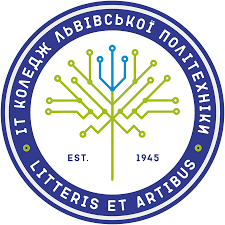

# 2023_VN_TK-42_OOP
# Опис репозиторію
Цей репозиторій призначений для зберігання та ведення проектів та завдань зв'язаних з предметом "Об'єктно-орієнтоване програмування".
## Навчальний заклад
[ІТ коледж Львівської політехніки](https://itcollege.lviv.ua)

## Студент
Студент Віталій Нагацький

## Група
Група ТК-42

## Список робіт
| Номер лабораторної | Назва лабораторної | Статус виконання |
|:---------------------|:----------------------|-------------------:|
| 1                   | [Створення репозиторію та робота з ним](init/README.md) | Виконано        |
| 2                   | [Оформлення робіт та створення першої програми](1_lab/README.md) | Виконано       |
| 3                   | Лабораторна робота  | -        |
| 4                   | Лабораторна робота | -        |
---

